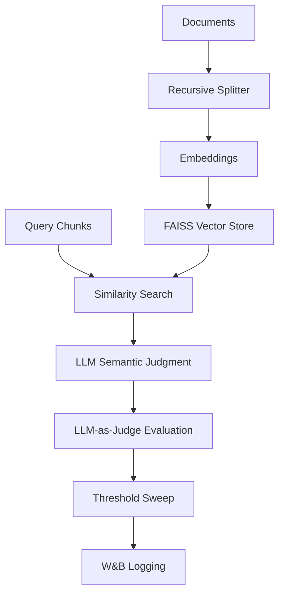
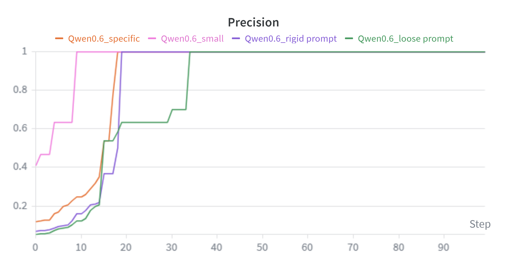
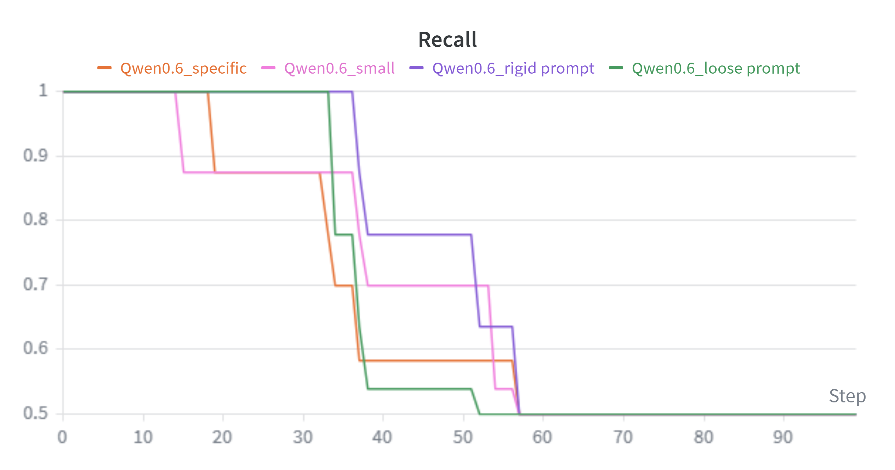
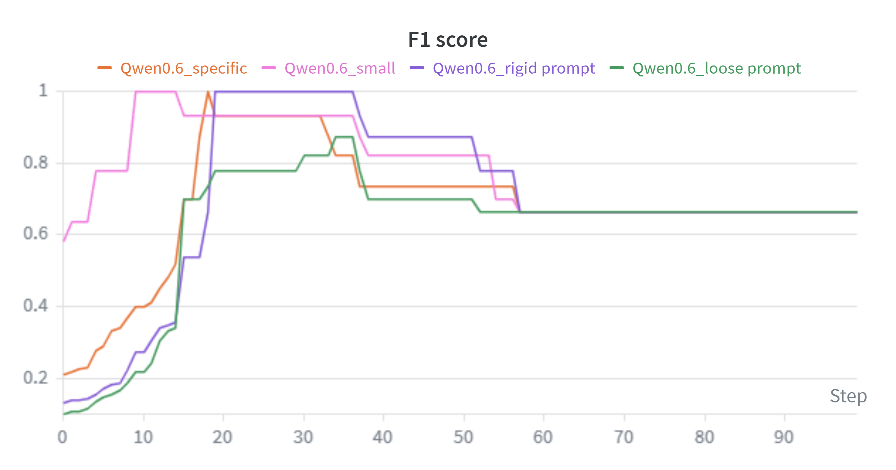
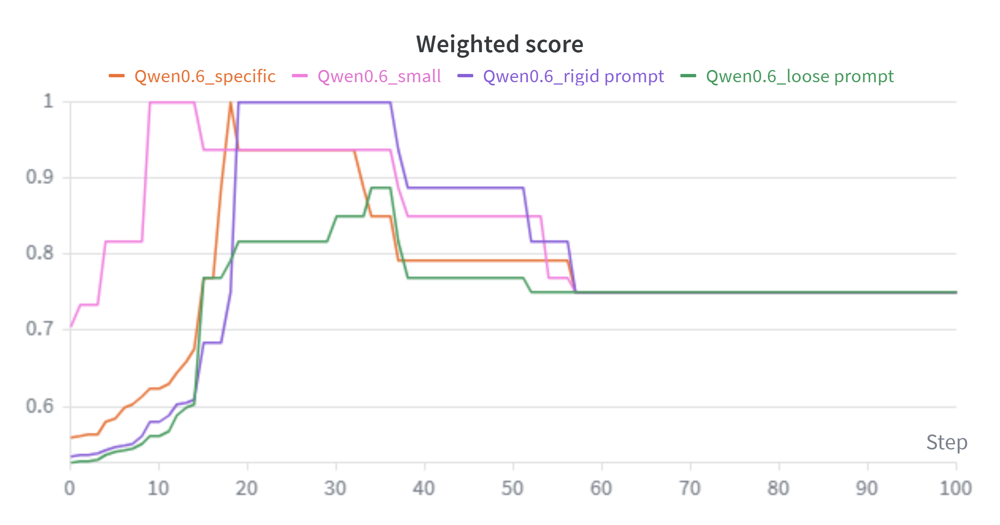
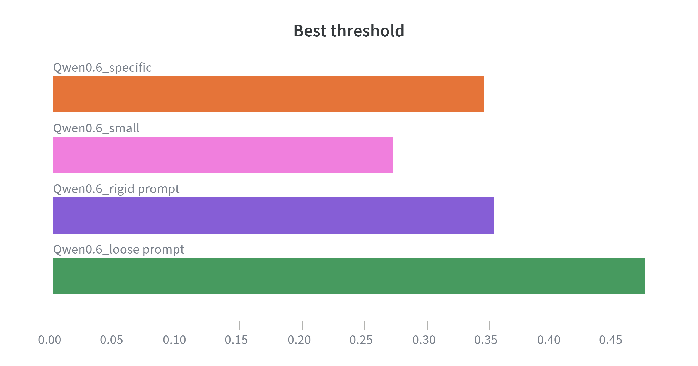

# RAG Pipeline with Threshold & Prompt Optimization

A synchronous modular Retrieval-Augmented Generation (RAG) system with similarity-based retrieval, LLM-as-Judge evaluation, prompt optimization, and threshold tuning tracked via Weights & Biases.

## Overview
The primary objective for this project is to optimize the navigation of complex legal texts and accelerate the identification of cross-document relationships. Unlike standard search tools, this pipeline is designed to parse dense, technical legal language where the relationship between clauses is often more important than keyword matching.

**THE Core idea** is a RAG system that will find similarities, supports and contradictions between documents.

This project implements a synchronous RAG pipeline with:

- FAISS-based dense retrieval
- Structured LLM generation
- LLM-as-Judge evaluation
- Prompt optimization
- Threshold tuning
- W&B experiment tracking

## Architecture

### Data Processing
- Document loading
- RecursiveCharacterTextSplitter (configurable chunk size & overlap)
- Embeddings (nomic-embed-text)

### Retrieval
- FAISS vector store
- Top-k similarity search (configurable)
- Relevance score extraction for threshold filtering

### Generation
- Structured prompt format
- Deterministic output constraints

### Evaluation
- LLM-as-Judge (JSON schema validation)
- Strict boolean metrics grading

### Threshold Tuning
- Threshold sweep (0.2 – 1.0)
- Precision & Recall computation
- F1-score maximization
- Weighted precision–recall scoring
- W&B metric logging
  
## Full Pipeline Execution
1. Document chunking
2. FAISS vector indexing
3. Similarity-based retrieval
4. LLM semantic relationship judgment
5. Structured evaluation
6. Threshold optimization with W&B logging


## Evaluation Logic
The judge model produces structured outputs validated via JSON schema.
```json
{
  "grounded": "bool" 
  "relevant": "bool"
  "retrieval_relevant": "bool"
  "correct": "bool"
}
```
- grounded → Answer supported by retrieved context
- relevant → Answer semantically relevant to the query
- retrieval_relevant → Retrieved chunk relevant to ground truth
- correct → Final correctness flag used for metric computation
  
## Optimization Results
<details>
  <summary>W&B Performance Results</summary>
  
  **Evaluation Context**

  Evaluation was conducted on the medical validation dataset using structured ground-truth labels.  
  Metrics are computed after similarity threshold filtering.
 
  ### Prompt Variant Comparison
  | Prompt version | Precision | Recall | F1 | Threshold |
  | :---: | :---: | :---: | :---: | :---: |
  | Qwen0.6_loose prompt | 1.00 | 0.78 | 0.88 | 0.48 |
  | Qwen0.6_rigid prompt | 1.00 | 1.00 | 1.00 | 0.35 |
  | Qwen0.6_small | 1.00 | 1.00 | 1.00 | 0.27 |
  | Qwen0.6_specific | 1.00 | 1.00 | 1.00 | 0.35 |

  ### Precision vs. Recall
  
  
  
  ### F1 vs. Weighted scores
  
  
  
  ### Threshold Optimization
  

  **Observation:**  
  Rigid and specific prompt variants achieved perfect F1 scores, indicating strong alignment between retrieval filtering and structured evaluation constraints.
</details>

## Reproducibility
- Embedding model: nomic-embed-text
- RAG model: qwen3:0.6b
- Judge model: llama3.1:8b
- Distance metric: Cosine
- Top-k: 5
- Chunk size: 300 (docs), 200 (queries)
- Overlap size: 50(docs), 0 (queries)

> [!NOTE]
> Configuration parameters can be modified via environment variables or a config file.

## Requirements
This project was developed and tested with the following environment:
- Python ≥ 3.10
- Ollama (local LLM runtime)
- Weights & Biases account (for experiment tracking)
  
### Core Python Dependencies
```txt
langchain
langchain-community
langchain-ollama
faiss-cpu
numpy
python-dotenv
wandb
```


